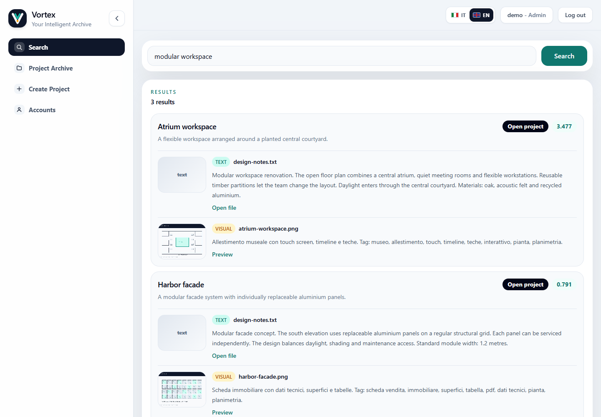
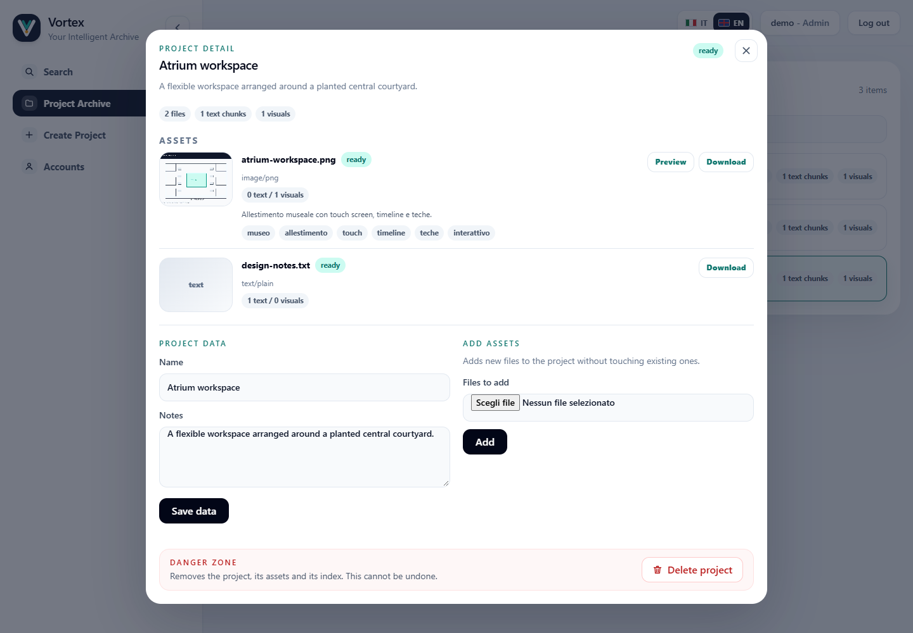
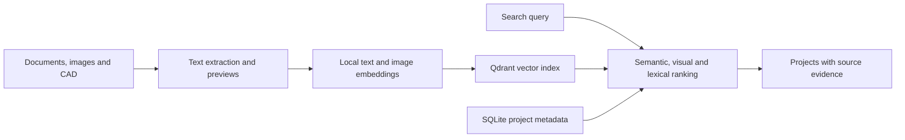

<p align="center">
  
</p>

<h1 align="center">Vortex</h1>

<p align="center"><strong>Find the project you remember, through the files you kept.</strong></p>
<p align="center">A local archive for documents, images and CAD drawings.<br>Search by meaning and visual similarity. Open the files behind each result.</p>

<p align="center">
  <a href="https://github.com/DavideWasTaken/Vortex/actions/workflows/check.yml"></a>
  
  <a href="LICENSE"></a>
</p>

<p align="center">
  <a href="#try-it-locally">Quick start</a> ·
  <a href="#what-you-can-do">Features</a> ·
  <a href="#how-it-works">How it works</a> ·
  <a href="#what-to-expect-from-search">Current limits</a>
</p>



*The running app with fictional demo projects. Results show source files, text excerpts and visual previews; scores are ranking hints.*

## Why Vortex?

You remember a courtyard layout, a material choice or an assembly detail. The filename is another matter.

Vortex keeps the files behind technical and creative projects together, so you can search their content and return to the original work. It combines local text and image models with title, filename and content matching.

**No external LLM API key is needed.** Model inference runs locally; the first use downloads model weights.

> **Working prototype.** Designed for a local machine or trusted team. Text and visual search work end to end, but retrieval quality has not been measured against a representative evaluation dataset. All signed-in users share one archive.

## What you can do

| | In Vortex |
| --- | --- |
| **Search beyond filenames** | Find projects using document text, semantic similarity and visual matches. |
| **See the source** | Inspect matching excerpts and previews, then open or download the original files. |
| **Keep projects together** | Upload files, edit project notes, add assets, reindex and delete projects. |
| **Work with mixed formats** | PDF, DOCX, text, Markdown, CSV/log, images and DXF; DWG support depends on optional converters. |
| **Run it locally** | FastEmbed models, Qdrant vector storage and SQLite metadata on your own machine or server. |
| **Share a team archive** | Admin and reader roles, authenticated downloads, and an Italian/English interface. |

<details>
<summary><strong>A closer look at a project</strong></summary>



An admin can inspect indexing status, download assets, edit notes and add files from the same project view. This screenshot uses the fictional Atrium workspace project.

</details>

## Try it locally

The simplest setup uses Docker Compose:

```bash
git clone https://github.com/DavideWasTaken/Vortex.git
cd Vortex
docker compose -f docker-compose.dev.yml up --build
```

Open **http://localhost:8000**. Development accounts are `admin / admin` and `user / user`. The app is bound to loopback, and Qdrant is accessible only inside the Compose network.

For a Python-only setup, use **Python 3.11+**:

```bash
python -m venv .venv
# Activate .venv for your shell, then:
python -m pip install -r backend/requirements.txt
python -m uvicorn app.main:app --app-dir backend --host 127.0.0.1 --port 8000
```

Without `QDRANT_URL`, Qdrant uses embedded local storage. Upload a small document, wait for its status to become ready, then search for a concept in its content.

**The first text or image operation downloads the required model weights.** Inference runs locally after the weights are cached; the default model cache is managed by FastEmbed. No external LLM API key is needed, and uploaded documents are not sent to an inference API.

## How it works



| Layer | Technology |
| --- | --- |
| API and access | Python · FastAPI · server-side sessions |
| Search models | FastEmbed · multilingual text embeddings · CLIP |
| Storage | Qdrant · SQLite · local files |
| Interface | HTML · JavaScript · locally bundled Tailwind CSS |

## Deployment and access

For the production configuration, copy `.env.example` to `.env`, set a unique bootstrap admin username and a password of at least 12 characters, and run:

```bash
docker compose -f docker-compose.prod.yml --env-file .env up --build -d
```

Use an HTTPS reverse proxy on the host to reach the loopback API port. Secure session cookies require HTTPS. Remove the bootstrap password from the runtime configuration after the initial admin is created. Production startup rejects the documented demo credentials.

Qdrant has **no published host port** in either Compose file. Keep it on the private Compose network: its payloads contain document excerpts. The app's login does not protect a separately exposed Qdrant endpoint.

All authenticated users share the same archive: admins can modify it and readers can search and download every project. There is no per-project or tenant isolation. Uploads, SQLite, and vector data are stored on disk without application-level encryption. See [the deployment checklist](PRODUZIONE.md) for the remaining operational work before handling sensitive data or serving external users.

## What to expect from search

Text search combines multilingual embeddings with title, filename, and content matches. Visual search uses CLIP embeddings; its displayed captions and tags come from a small predefined taxonomy rather than an unrestricted image description model.

Scanned PDFs do not receive dedicated OCR. PDF visual indexing is capped by `VORTEX_MAX_PDF_PAGES_RENDERED` (40 by default). DWG conversion depends on tools such as ODA File Converter or LibreDWG; without them, Vortex falls back to metadata and, where possible, a related PDF. CAD previews are approximate illustrations, not geometry verification.

Indexing runs in the web process. Interrupted work may require reindexing, and this release has no durable job queue or tested backup/restore workflow. Similarity scores are ranking hints, not calibrated confidence estimates.

## Development and tests

```bash
python -m pip install -r requirements-dev.txt
python -m pytest -q
```

API regression tests exercise authentication, reader permissions, uploads, indexing, retrieval, downloads, deletion, and session revocation. They use temporary SQLite/Qdrant storage and deterministic embedding stubs, so they require no model downloads and do not evaluate semantic relevance. Deployment tests guard the network boundaries in Compose.

The CSS bundle is checked in, so Node.js is only needed when changing Tailwind classes:

```bash
npm ci --ignore-scripts
npm run build:css
```

| Path | Purpose |
| --- | --- |
| `backend/app/main.py` | API, access controls, and browser UI |
| `backend/app/extraction.py` | Text extraction, validation, and previews |
| `backend/app/search.py` | Embeddings, Qdrant, and result grouping |
| `backend/app/indexer.py` | Project indexing workflow |
| `backend/app/db.py` | Projects, assets, users, and sessions |
| `tests/` | API and deployment regression checks |

## License

[MIT](LICENSE). Third-party libraries, model weights, and CAD converters retain their own licenses.
